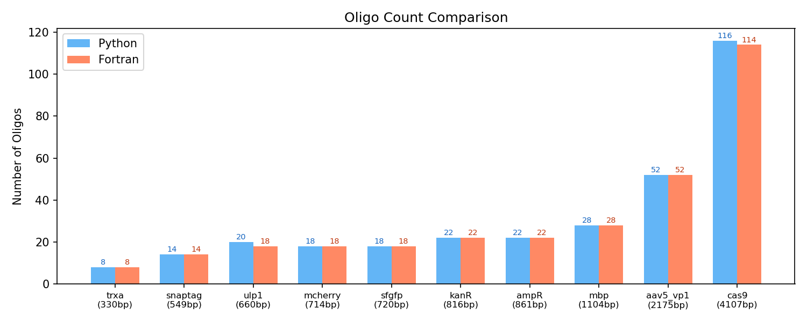
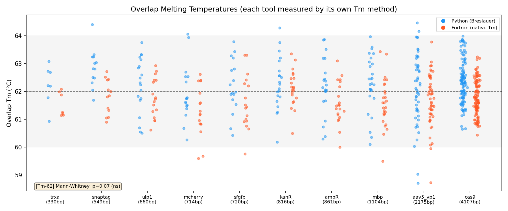
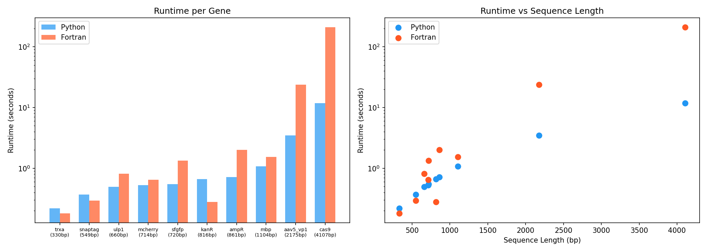

# dnaworks_py

A Python reimplementation of [DNAWorks](https://github.com/davidhoover/DNAWorks) for automated design of overlapping oligonucleotides for PCR-based gene assembly.

Given a DNA sequence, `dnaworks_py` designs a set of overlapping oligos that tile the full gene and can be assembled by overlap-extension PCR. Each overlap junction is optimized to hit a target melting temperature, and the placement is scored to minimize mispriming risk, internal repeats, and extreme GC/AT content.

## Why a rewrite?

DNAWorks (Hoover & Lubkowski, *Nucleic Acids Res.* 2002) is a widely used Fortran tool for oligo design. This Python reimplementation offers several advantages:

- **Modern Tm calculation** — uses Breslauer 1986 nearest-neighbor parameters with SantaLucia 1998 salt correction, matching [Benchling's](https://www.benchling.com) "Modified Breslauer" method. Validated against Benchling's Tm calculator.
- **Dramatically faster on large genes** — 12 seconds vs. 211 seconds for a 4.1 kb gene (Cas9), with equivalent output quality (see [benchmarks](#benchmark-results) below).
- **Easier to install and extend** — `pip install biopython` is the only dependency. No Fortran compiler needed.
- **Scriptable** — JSON output for integration with downstream pipelines.

## Installation

```bash
git clone https://github.com/AdamTSmiley/dnaworks_py.git
cd dnaworks_py
```

**With conda** (recommended):
```bash
conda env create -f environment.yml
conda activate dnaworks
```

**With pip**:
```bash
pip install .
```

**For development** (editable install):
```bash
pip install -e .
```

To run the benchmark comparison, install optional dependencies:
```bash
pip install ".[benchmark]"
```

## Usage

```bash
# From a FASTA file
python cli.py my_gene.fa

# From a raw sequence
python cli.py ATGAAACCC...TAA

# Custom parameters
python cli.py my_gene.fa --tm 60 --length 50 --tm-tolerance 1.5

# JSON output for scripting
python cli.py my_gene.fa --json

# Simulated annealing for difficult sequences
python cli.py my_gene.fa --random-length --seed 42

# Minimal oligo length (no gaps between overlaps)
python cli.py my_gene.fa --nogaps
```

### Options

| Flag | Default | Description |
|------|---------|-------------|
| `--tm` | 62.0 | Target overlap melting temperature (°C) |
| `--tm-tolerance` | 2.0 | Acceptable Tm deviation (°C) |
| `--length` | 60 | Target oligo length (nt) |
| `--method` | breslauer86 | Tm method (`breslauer86` or `santalucia97`) |
| `--na` | 50.0 | Sodium concentration (mM) |
| `--mg` | 0.0 | Magnesium concentration (mM) |
| `--dnac` | 250.0 | Total primer concentration (nM) |
| `--nogaps` | off | No gaps between overlaps |
| `--random-length` | off | SA optimizer with randomized oligo lengths |
| `--seed` | None | Random seed for reproducibility |
| `--json` | off | Machine-readable JSON output |
| `--quiet` | off | Suppress progress messages |

### Example output

```
======================================================================
dnaworks_py — Oligonucleotide Design Report
======================================================================

Sequence length:    720 bp
GC content:         50.8%
Tm method:          breslauer86
Target Tm:          62.0°C (±2.0°C)
Target oligo len:   60 nt
Design time:        0.6s

Overlaps (17):
    #  Start    End  Len      Tm
  ---  -----  -----  ---  ------
    1     14     30   17    62.5
    2     55     73   19    61.2
    3     94    113   20    63.1
  ...

Oligos (18):
    #     Strand  Len          Pos  Sequence
  ---  ---------  ---  -----------  --------
    1      sense   30      1-30     ATGGTGAGCAAAGGCGAAGAACTGTTTACCG
    2  antisense   60     14-73     ATCCAGTTCAACCAGAATCGGCACCACGCCG...
  ...
```

## How it works

The algorithm follows the same core logic as the original DNAWorks:

1. **Binary search for overlap boundaries** — for each overlap junction, a binary search (ForOlap / RevOlap) extends the overlap region until its Tm hits the target.
2. **Shift-based optimization** — tries up to 1,000 different starting offsets and keeps the arrangement with the lowest composite score.
3. **Multi-objective scoring** — each arrangement is scored on Tm deviation, mispriming potential (all-vs-all 3' tip scanning), direct and inverted repeats, GC/AT content stretches, and oligo length.
4. **Odd-overlap constraint** — assembly PCR requires an odd number of overlaps; arrangements with even overlap counts are rejected.

For difficult sequences, the `--random-length` flag enables a simulated annealing optimizer that varies oligo lengths to explore different overlap placements.

## Benchmark results

Benchmarked against the original Fortran DNAWorks across 10 genes spanning 330–4,107 bp and 35–58% GC content. Both tools were configured with identical targets (62°C Tm, 60 nt oligos, ±2°C tolerance). Each tool's overlaps are evaluated using its own Tm method for a fair comparison: Breslauer for `dnaworks_py`, SantaLucia/HyTher for the Fortran.

### Both tools produce the same number of oligos

Oligo counts are nearly identical across all 10 test genes, confirming that both tools divide the sequences equivalently.



### Overlap Tm accuracy is equivalent

Each tool's overlaps are measured against the 62°C target using its own Tm method. Both cluster tightly within the ±2°C tolerance band (gray). No statistically significant difference in Tm deviation (Mann-Whitney p=0.07, Wilcoxon p=0.11).



### Python is dramatically faster on large genes

For typical genes under 1 kb, both tools run in under a second. For larger genes, `dnaworks_py` scales much more favorably — Cas9 (4.1 kb) completes in 12 seconds vs. 211 seconds for the Fortran implementation (18× faster).



### Full comparison

No statistically significant differences in any design quality metric (all p > 0.05):

| Metric | Python (mean) | Fortran (mean) | p-value |
|--------|--------------|----------------|---------|
| \|Tm − 62°C\| | 0.78°C | 0.65°C | 0.07 (ns) |
| Overlap ΔG | −1.14 kcal/mol | −1.09 kcal/mol | 0.68 (ns) |
| Overlap GC% | 46.3% | 46.1% | 0.95 (ns) |
| Overlap length | 21.5 nt | 20.9 nt | 0.25 (ns) |

## Architecture

| File | Description |
|------|-------------|
| `cli.py` | Command-line interface, text + JSON output |
| `tm.py` | BioPython Tm wrapper (Breslauer / SantaLucia) |
| `sequence.py` | DNA validation, reverse complement, FASTA I/O |
| `scoring.py` | Misprime, repeat, GC/AT, Tm, and length scoring |
| `overlaps.py` | Binary search overlap placement, shift optimization |
| `optimizer.py` | Simulated annealing for random-length mode |

## Dependencies

**Core** (installed automatically):
- Python ≥ 3.10
- [BioPython](https://biopython.org/) ≥ 1.80

**Benchmark only** (`pip install ".[benchmark]"`):
- matplotlib
- scipy
- [ViennaRNA](https://www.tbi.univie.ac.at/RNA/)

## References

- Hoover DM, Lubkowski J. DNAWorks: an automated method for designing oligonucleotides for PCR-based gene synthesis. *Nucleic Acids Res.* 2002;30(10):e43.
- Breslauer KJ, Frank R, Blöcker H, Marky LA. Predicting DNA duplex stability from the base sequence. *Proc Natl Acad Sci USA.* 1986;83(11):3746–3750.
- SantaLucia J Jr. A unified view of polymer, dumbbell, and oligonucleotide DNA nearest-neighbor thermodynamics. *Proc Natl Acad Sci USA.* 1998;95(4):1460–1465.

## License

MIT
